# Homework 7: Linux CLI Practice

## Overview
In this homework assignment, we practiced various Linux CLI tools to perform operations such as counting words, characters, and lines in a file, sorting file sizes, extracting specific columns from CSV files, and manipulating text using cut, head, tail, and grep commands. We also worked with regular expressions to search for specific patterns, redirected command outputs to files, and combined commands using pipes. 

## Problems

**Problem 1:** Count the number of words in lorem-ipsum.txt
`$ wc -w lorem-ipsum.txt`
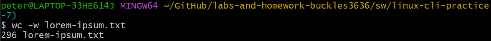

**Problem 2:** Count the number of characters in lorem-ipsum.txt
`$ wc -m lorem-ipsum.txt`
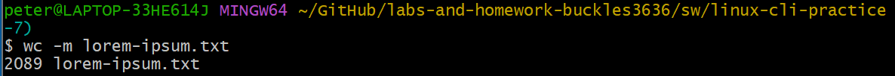

**Problem 3:** Count the number of lines in lorem-ipsum.txt
`$ wc -l lorem-ipsum.txt`
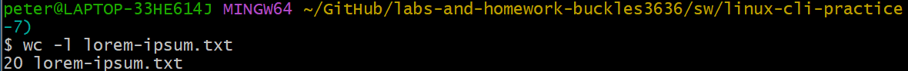

**Problem 4:** Numerically sort file-sizes.txt, taking unit multipliers into account (e.g., 2K, 1G, 4M)
`$ sort -h file-sizes.txt`
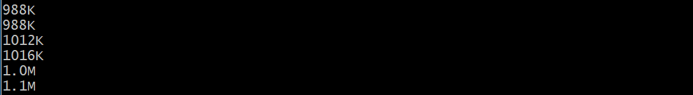

**Problem 5:** Numerically sort file-sizes.txt in reverse order, taking unit multipliers into account
`$ sort -h -r file-sizes.txt`
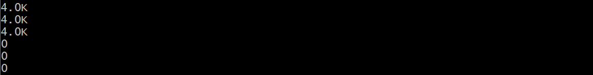

**Problem 6:** Return the IP address column from log.csv
`$ cut -d, -f3 < log.csv`
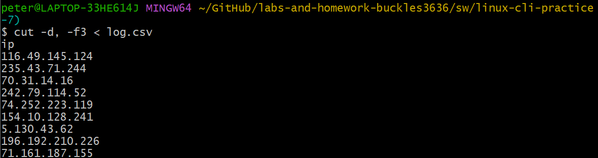

**Problem 7:** Return the timestamp and IP address columns from log.csv
`$ cut -d, -f2,3 < log.csv`
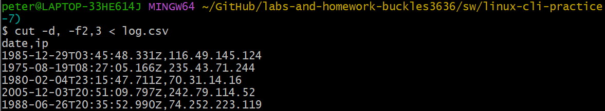

**Problem 8:** Return the UUID and country columns from log.csv
`$ cut -d',' -f1,4 log.csv`
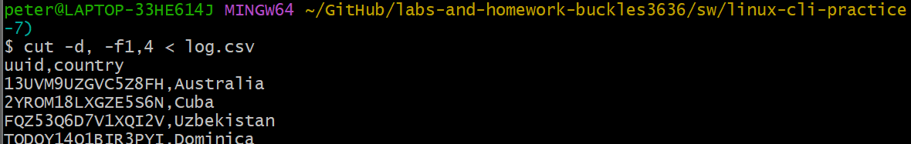

**Problem 9:** Print out the first 3 lines of gibberish.txt
`$ head -n 3 gibberish.txt`
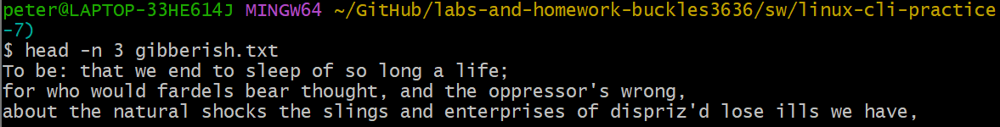

**Problem 10:** Print out the last 2 lines of gibberish.txt
`$ tail -n 2 gibberish.txt`
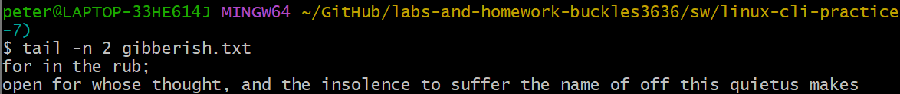

**Problem 11:** Print out log.csv without the header (i.e., all but the first line)
`$ tail -n +2 log.csv`
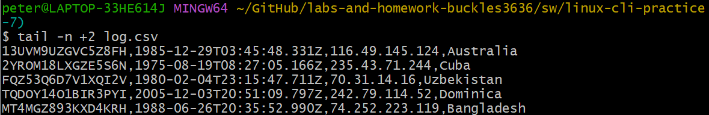

**Problem 12:** Search for “and” in gibberish.txt
`$ grep 'and' gibberish.txt`
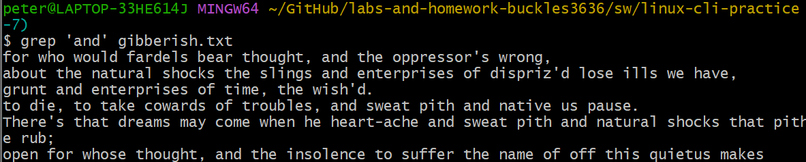

**Problem 13:** Display each occurrence of “we” (only match “we” as a whole word, not as part of another word), including the line number
`$ grep -w -n 'we' gibberish.txt`
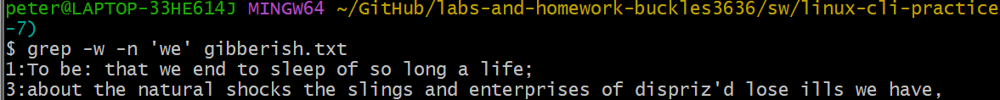

**Problem 14:** Print all occurrences of "to <word>" in gibberish.txt on their own line
`$ grep -oP 'to \w+' gibberish.txt`
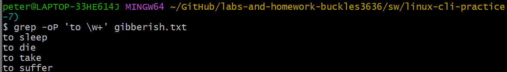

**Problem 15:** Count how many lines "FPGAs" shows up in fpgas.txt
`$ grep -c 'FPGAs' fpgas.txt`
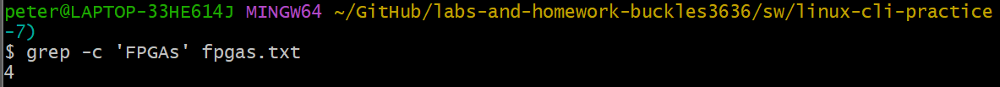

**Problem 16:** Print all the rhyming lines in fpgas.txt
`$ grep -P "([hn]ot|[ct]ower|[smcope]+ile)" fpgas.txt`
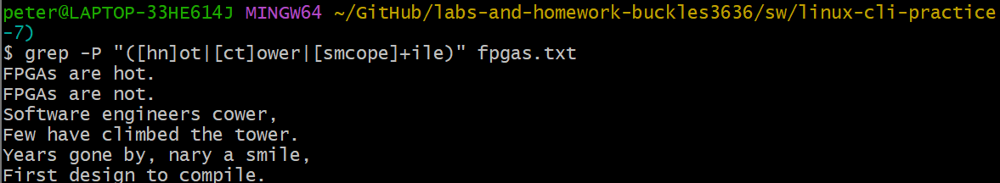

**Problem 17:** Count how many lines start with a comment for each VHDL file in your hdl/ folder
`$ grep -c -P '(--)+' -r hdl/*/*.vhd`
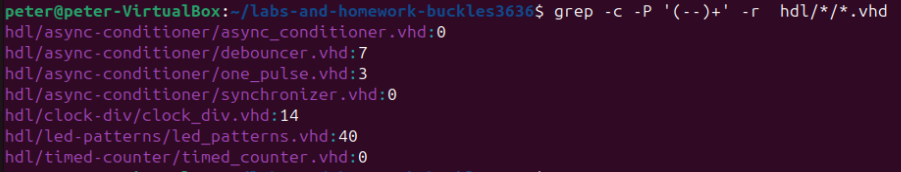

**Problem 18:** Redirect the output of ls to a file and display the file contents
`$ ls > ls-output.txt && cat ls-output.txt`
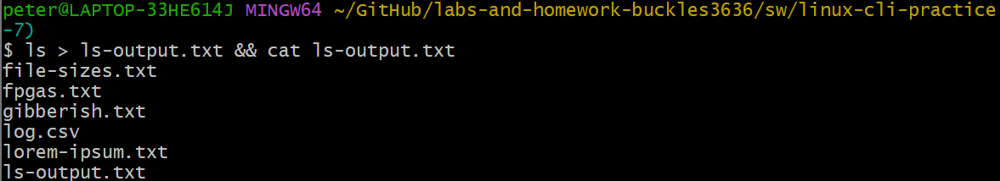

**Problem 19:** Search for "CPU" in the output of dmesg (you will need sudo)
`$ sudo dmesg | grep 'CPU'`
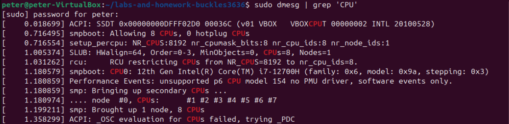

**Problem 20:** Count how many VHDL files are in your hdl/ directory
`$ find hdl/ -iname '*.vhd' | wc -l`
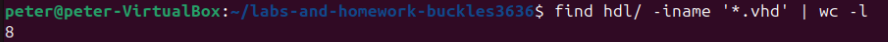

**Problem 21:** Count the total number of comment lines in your hdl/ folder
`$ grep -r '^--' hdl/ | wc -l`
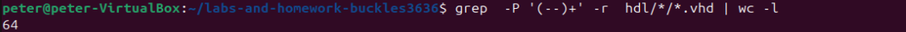

**Problem 22:** Print the line numbers where "FPGAs" shows up in fpgas.txt
`$ grep -P '(--)+' -r hdl/*/*.vhd | wc -l` 
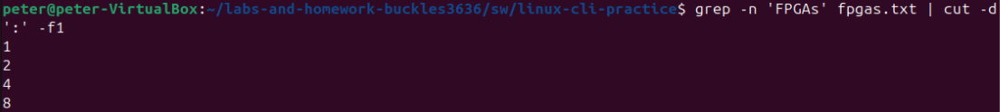

**Problem 23:** Find the 3 largest directories in your repository and print their sizes and names
`$ du -h --max-depth=1 | sort -hr | head -n 3`
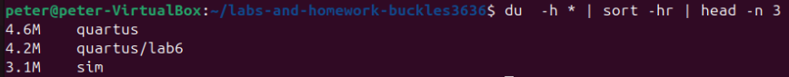

